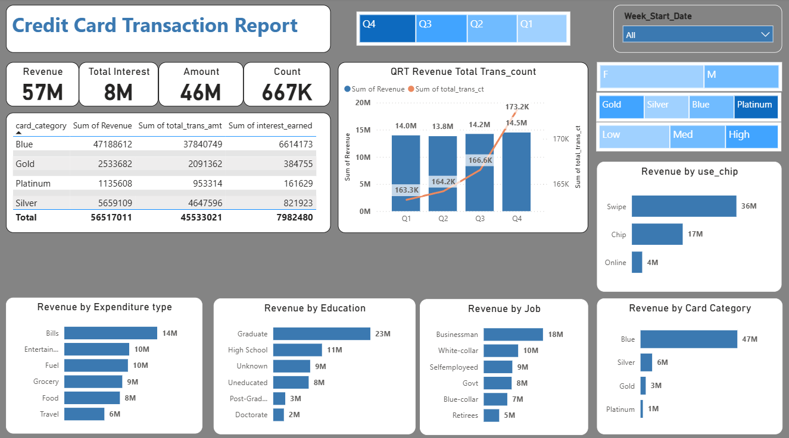

# 💳 Credit Card Financial Dashboard | Power BI

## 📌 Project Overview

This Power BI dashboard provides a comprehensive analysis of credit card customers and transaction performance. It enables business stakeholders to monitor customer demographics, spending behavior, transaction trends, and revenue generation to support strategic business decisions.

The project consists of two interactive dashboard pages:

- Customer Report
- Transaction Report

## 🎯 Business Problem

Financial institutions generate millions of credit card transactions every month. However, identifying high-value customers, understanding spending behavior, and monitoring business performance can be difficult without a centralized reporting solution.

This dashboard helps answer questions such as:

- Which customer segments generate the highest revenue?
- Which card category is most profitable?
- Which customer demographics contribute the most?
- What are the transaction trends over time?
- Which expenditure categories drive the highest revenue?

---

# 📊 Dashboard Pages

## 1️⃣ Customer Report

### Dashboard Preview

<h2>Customer Dashboard</h2>

  

### KPIs

- Revenue
- Total Interest Earned
- Total Income
- Customer Satisfaction Score (CSS)

### Analysis Included

- Revenue Trend by Week
- Top 5 States
- Revenue by Gender
- Revenue by Income Group
- Revenue by Customer Job
- Revenue by Age Group
- Revenue by Marital Status
- Revenue by Dependents
- Revenue by Education

Interactive Filters

- Quarter
- Week
- Card Category
- Gender
- Transaction Mode

---

## 2️⃣ Transaction Report

### Dashboard Preview

<h2>Transaction Dashboard</h2>

  

### KPIs

- Revenue
- Interest Earned
- Total Transaction Amount
- Total Transaction Count

### Analysis Included

- Quarterly Revenue Trend
- Transaction Count Trend
- Revenue by Card Category
- Revenue by Expenditure Type
- Revenue by Job
- Revenue by Education
- Revenue by Chip Usage

Interactive Filters

- Quarter
- Week
- Gender
- Card Category
- Income Group

# 📈 Key Business Insights

### Customer Dashboard

- Revenue exceeded **57 Million**.
- High-income customers generated the highest revenue.
- Customers aged **40–50 years** contributed the largest share.
- Businessman and White-collar professionals were the highest revenue-generating occupations.
- Married customers generated more revenue than single customers.
- Texas, California, and New York were among the top-performing states.

### Transaction Dashboard

- Blue Card generated the highest revenue.
- Swipe transactions dominated overall transaction volume.
- Bills and Entertainment were the highest spending categories.
- Graduate customers contributed the highest revenue.
- Quarterly revenue remained stable with slight growth in Q4.

---

# 💡 Business Recommendations

- Launch premium offers targeting high-income customers.
- Increase marketing efforts in low-performing states.
- Promote digital payment methods to increase online transaction adoption.
- Design reward programs for high-value card holders.
- Create personalized campaigns based on customer occupation and spending behavior.
- Focus customer retention strategies on profitable customer segments.

---

# 🛠 Tools & Technologies

- Microsoft Power BI
- Power Query
- DAX
- Data Modeling
- CSV Data Sources
- SQL Database

# ⚙ Data Preparation
The dataset was cleaned and transformed using Power Query.

Performed operations include:

- Removed duplicate records
- Handled missing values
- Corrected data types
- Created relationships
- Built star schema model
- Created calculated columns
- Developed DAX measures

---

# 📊 Data Model
The project follows a Star Schema model.

Fact Table
- Credit Card Transactions

Dimension Tables
- Customer
- Card Details
- Geography
- Date

# 📐 DAX Measures Used
Examples include:
- Total Revenue
- Total Interest Earned
- Total Income
- Transaction Count
- Customer Satisfaction Score
- Revenue by Quarter
- Revenue Growth
- Dynamic KPIs

# 🎨 Dashboard Features
- Interactive Slicers
- Cross Filtering
- Drill Down
- Dynamic Visuals
- KPI Cards
- Time Intelligence
- Responsive Dashboard Layout
  
# 📂 Project Structure
Credit-Card-Financial-Dashboard/

├── Credit Card Financial Dashboard.pbix

├── Customer Dashboard.png

├── Transaction Dashboard.png

├── customer.csv

├── credit_card.csv

├── cc_add.csv

├── cust_add.csv

└── README.md

# 🚀 Skills Demonstrated
- Data Cleaning
- Data Transformation
- Data Modeling
- Star Schema Design
- DAX
- Power Query
- Business Intelligence
- Dashboard Design
- Data Visualization
- Business Storytelling
- KPI Development
  
# 👨‍💻 Author
Jagdish Jena
Power BI | SQL | Excel | Data Analytics
